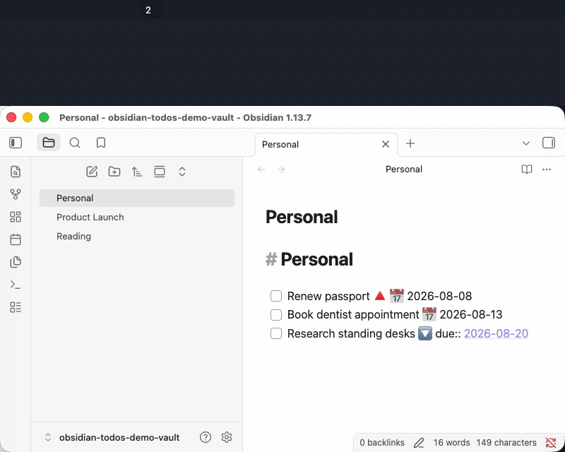
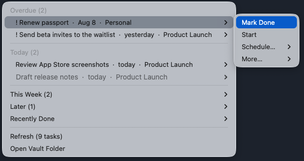

<div align="center">

# Obsidian TODOs Menubar

### Your vault's overdue and today tasks, one click from the menubar.

</div>

Obsidian holds your tasks, but it is rarely the app you're in when you wonder what's due. This script puts a count in the menubar: how many tasks are overdue, or if none are, how many are due today. The number turns red when something is overdue. Click it and each task carries Mark Done, Start, and reschedule actions that write back into the note.

It writes one line per action: the task line you clicked, and only after re-reading it on disk to confirm it still matches what the menu showed. If the note changed underneath, it refreshes instead of guessing. Everything is local: one ripgrep scan and a file watcher, no daemon and no network.

<div align="center">



</div>

*The demo runs against a staged vault. The menu, the count, and the edit landing in Obsidian are real.*

## Install

1. Install [Hammerspoon](https://www.hammerspoon.org/) and ripgrep (`brew install ripgrep`)
2. Download the script:
   ```bash
   curl -L https://raw.githubusercontent.com/wilbeibi/obsidian-todos-menubar/main/obsidian-todos.lua -o ~/.hammerspoon/obsidian-todos.lua
   ```
3. Add to `~/.hammerspoon/init.lua`:
   ```lua
   require('obsidian-todos')
   ```
4. If your vault isn't in the default iCloud location, point at it from the Hammerspoon Console:
   ```lua
   hs.settings.set('obsidianTodos.vaultPath', '/absolute/path/to/YourVault')
   hs.reload()
   ```
5. Give Hammerspoon Full Disk Access (System Settings → Privacy & Security) so ripgrep can read iCloud vaults.

Optional: with the [Advanced URI plugin](https://github.com/Vinzent03/obsidian-advanced-uri) installed, clicking a task opens the exact line instead of the file.

## Task format

Plain markdown checkboxes, anywhere in the vault:

```markdown
- [ ] Basic task
- [/] In-progress task
- [-] Cancelled task (hidden)
- [ ] High priority 🔺
- [ ] Due date 📅 2026-08-15
- [ ] Dataview style due:: [[2026-08-15]]
- [ ] TaskPaper style @due(2026-08-15)
- [/] Snoozed 🛫 2026-08-20
```

Priorities `🔺⏫🔼🔽⏬` weight the sort order. A bare `YYYY-MM-DD` also counts as a due date when the line mentions "due". Rescheduling rewrites whichever notation the line already uses.

## What the menu does

<div align="center">



</div>

- The menubar count covers one tier at a time: overdue if any, else today, else this week, else the backlog. The hover tooltip breaks down all three.
- Overdue and Today stay inline. This Week, Later, and Recently Done collapse into submenus, each ending in an Obsidian search link for the full list.
- Rows are rendered the way Obsidian renders them: date markers become `Aug 8` or `today`, links become their label, and `!` marks the two highest priorities. In-progress tasks are greyed. The raw line in your note is untouched.
- Each task's submenu holds **Mark Done**, **Start**, **Schedule…** (Due Tomorrow, Due in 7 Days, Snooze 1 Week, which lands on a weekday), and **More…** (Cancel Task, Ignore All Tasks in This Note).
- Actions write Tasks-plugin markers into the note: done appends `✅ 2026-08-11`, start `⏳`, cancel `❌`, snooze `🛫 2026-08-18`.
- **Stalled Review** appears at the top when a task has sat 8+ days past due, or 15+ past scheduled. Its submenu offers finish, rewrite, or cancel; deferring is still possible, but only through **Defer Anyway…**.
- Clicking a task opens it in Obsidian. Saving any note refreshes the menu about 2 seconds later; `Refresh` exists for impatience.

## Configuration

Vault path resolution order: `hs.settings.get('obsidianTodos.vaultPath')`, then the environment variables `OBSIDIAN_TODOS_VAULT` / `OBSIDIAN_VAULT_PATH` / `OBSIDIAN_VAULT_ROOT`, then the default iCloud vault.

Tweakables at the top of `obsidian-todos.lua`:

- `menubarTitle` — what shows when nothing is pending (default `☑︎`)
- `menuLimits` — tasks shown per section
- `debounceDelay` — seconds between a file change and the rescan
- `vaultName` — override the vault name used in `obsidian://` links

## Limitations

- macOS with Hammerspoon only. This is a script, not a standalone app.
- Watches one vault at a time.
- Only checkbox lines are tasks. No recurring tasks.
- It is a menu, not a notifier. Nothing pops up when a task comes due.
- Scans skip `Archive/`, `Templates/`, `.obsidian/`, and `.trash/`. Notes with `obsidian-todos-ignore: true` in their frontmatter are excluded entirely.

## Troubleshooting

- **Menu says vault missing** — check `hs.settings.get('obsidianTodos.vaultPath')` in the Hammerspoon Console.
- **A task doesn't show up** — the line must start with a markdown checkbox, and `rg` must exist (`which rg`).
- **Menu feels stale** — use `Refresh`; if that fixes it, the watcher is likely blocked by missing Full Disk Access.

## Development

Everything lives in `obsidian-todos.lua`; `make lint` runs luacheck. Core helpers: `scanVault` (ripgrep and parsing), `buildMenu` / `updateMenu` (sections and count), `displayLabel` (Obsidian-style row rendering), and the `markTask*` family (guarded single-line edits).

The demo was recorded against a synthetic vault opened in Obsidian; `demo/seed-vault.sh` seeds it with dates relative to today, so the recording reproduces any day.

Issues and pull requests welcome. MIT license.
